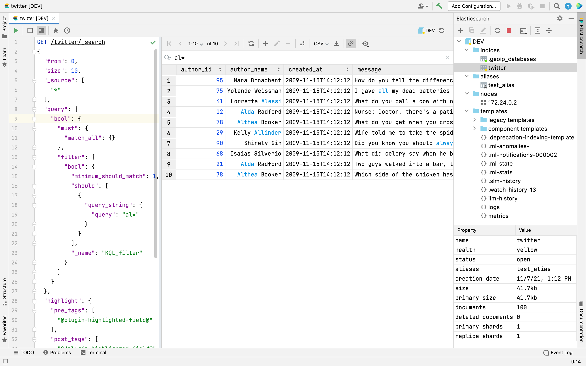

# IntelliJ Elasticsearch Plugin for IntelliJ IDEA

[IntelliJ Elasticsearch](https://www.intellij-elasticsearch.com/) plugin is a GUI Client for Elasticsearch based on IntelliJ Platform.
It is designed to query and manage Elasticsearch cluster.
You can connect to a local cluster, to a server, or in the cloud.
Supports all versions of Elasticsearch and OpenSearch.

For the documentation please visit [Documentation](https://www.intellij-elasticsearch.com/docs/getting-started/overview/).

To get the IntelliJ Elasticsearch plugin visit [Jetbrains Marketplace](https://plugins.jetbrains.com/plugin/14512-elasticsearch).

To get a quick tour of basic IntelliJ Elasticsearch features, see the [introduction video](https://youtu.be/lSsnPGMG830) (3 minutes).

