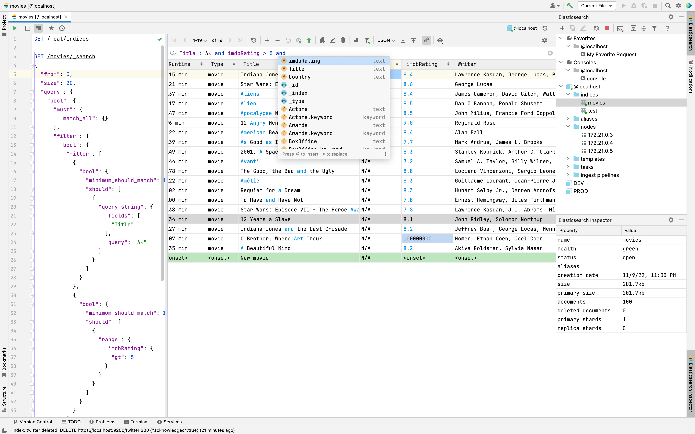
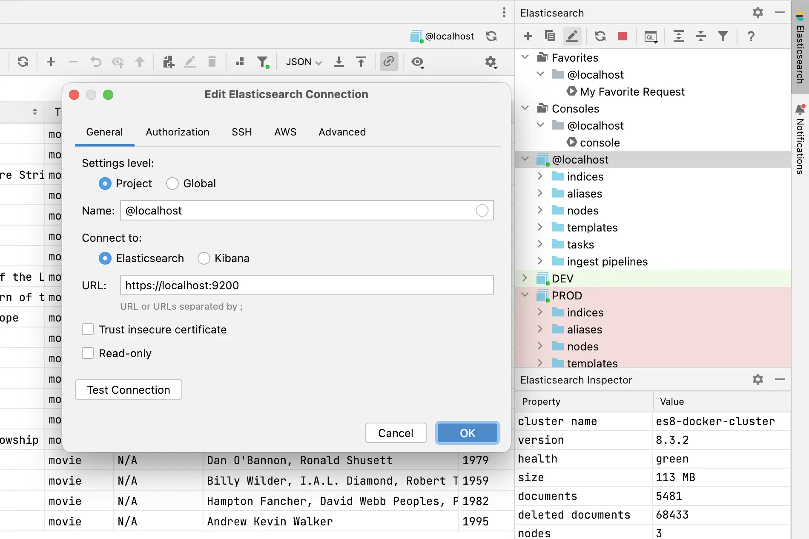
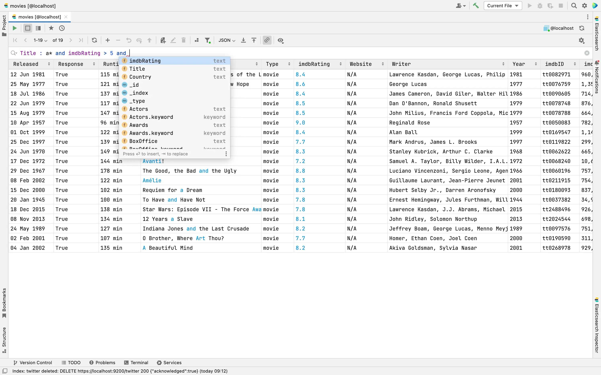
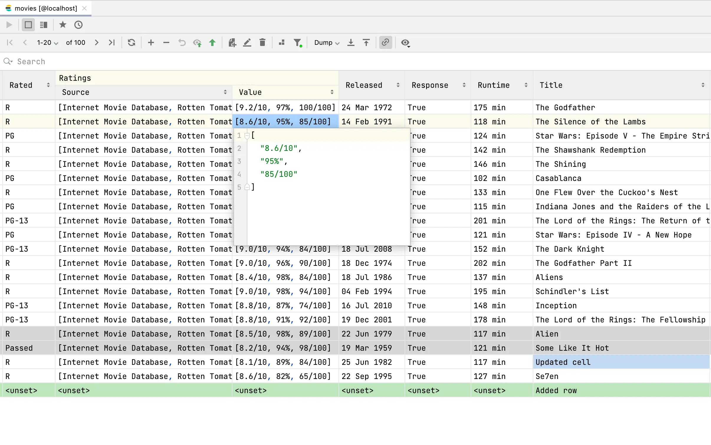
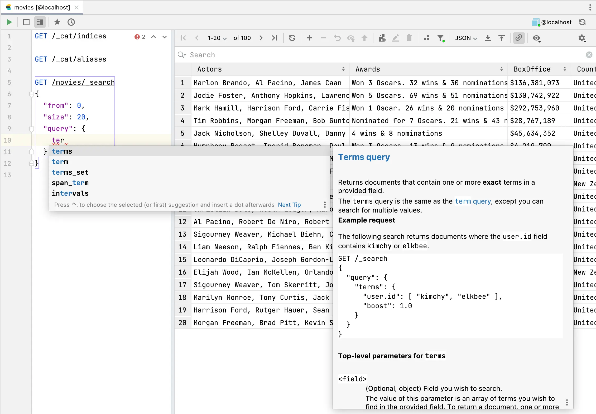
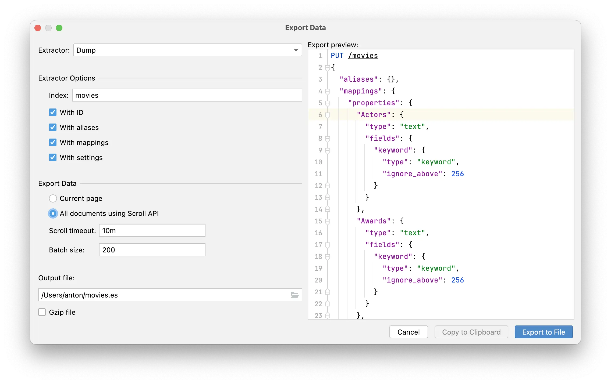
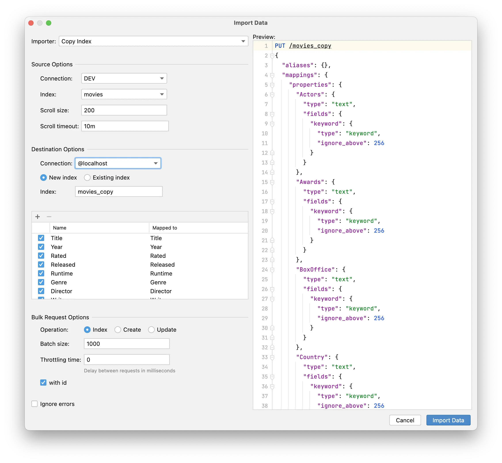

# Elasticsearch Plugin for JetBrains IDEs

### Intro

[Elasticsearch Plugin](https://www.elasticsearch-idea.com/) is a GUI Client for Elasticsearch based on IntelliJ Platform.
It is designed to query and manage Elasticsearch cluster.
You can connect to a local cluster, to a server, or in the cloud.
Supports all versions of Elasticsearch and OpenSearch.

For the documentation please visit [Documentation](https://www.elasticsearch-idea.com/docs/getting-started/overview/).

To get the Elasticsearch plugin visit [Jetbrains Marketplace](https://plugins.jetbrains.com/plugin/14512-elasticsearch).

To get a quick tour of basic Elasticsearch plugin features, see the [introduction video](https://youtu.be/lSsnPGMG830) (3 minutes) 
but it is a bit outdated.

### Features

#### Create many connections to Elasticsearch or OpenSearch clusters with Authorization, SSL, SSH, AWS Signature

#### Browse your data with a Table or JSON Views. Use Pagination, Sorting and Filtering with Kibana Query Language (KQL).

#### Create, Update, Delete documents right in the table or in the JSON editor dialog.

#### QueryDSL and Rest API autocomplete with Elasticsearch Documentation

#### Export data to CSV, JSON, Bulk API or Dump file

#### Import data from CSV, JSON, Dump file or Copy indexes

#### Other features
- Save `.es` files with requests in your project and share them with your team 
- Save your favorite queries and access them from the explorer tool window
- History of all executed requests
- and more...
